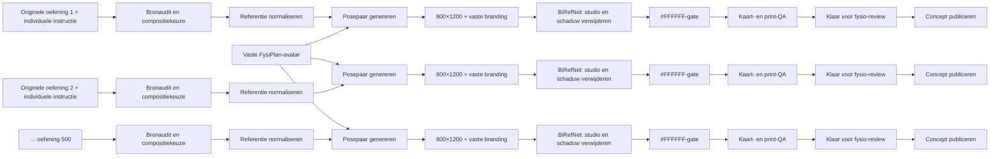

# FysiPlan oefenbeelden-graph

De 500 beelden worden niet als één oncontroleerbare batch gemaakt. Elke oefening is een eigen tak in een gerichte acyclische graph (DAG). Daardoor kan een mislukte generatie worden herhaald zonder geslaagde beelden opnieuw te betalen of te overschrijven.

De graph publiceert uitsluitend naar `public/oefeningen-v2.json`. De historische lijntekeningencatalogus in `public/oefeningen.json` is geen node in deze productiegraaf en kan daardoor niet door een dagelijkse Runway-run worden gewijzigd.



## Beeldspecificatie

- Eén herkenbare vrouwelijke avatar, lichtgrijs shirt, antracietkleurige broek en lichte sportschoenen.
- Eén volledig effen `#FFFFFF`-achtergrond zonder zichtbare vloer, grijsverloop of contactschaduw bespaart printerinkt; contourlicht op de persoon houdt het lichtgrijze shirt ook in zwart-wit duidelijk zichtbaar.
- Begin- en eindhouding in één doorlopende studio zonder scheidingslijn.
- Staande bewegingen staan naast elkaar; liggende, horizontale en grote apparaatoefeningen boven elkaar zodat de actieve keten groter in het portretvlak past.
- Camerastand is licht gedraaid, behalve wanneer een helder zijaanzicht klinisch noodzakelijk is.
- FysiPlan-logo en naam worden na generatie exact linksboven geplaatst; het model mag zelf geen tekst of logo tekenen.
- Elke gepubliceerde beeldgeneratie krijgt een nieuw versienummer in de bestandsnaam, zodat een browser nooit een oudere kaart uit de 24-uurs afbeeldingscache kan tonen.
- De individuele Nederlandse instructie is leidend. De oorspronkelijke oefeningafbeelding is een secundaire posehint en wordt genegeerd wanneer hij met de tekst botst; brede opnamebatchvelden worden bewust niet gebruikt.
- Een afzonderlijke graph-gate eist een neutrale randmediaan van minimaal 245/255; een grijze studio kan daardoor niet ongemerkt worden gepubliceerd.
- Na generatie verwijdert `scripts/normalize-exercise-backgrounds.py` lokaal de studio en schaduwen met BiRefNet, zet de vrijstaande persoon en benodigde apparatuur op `#FFFFFF` en schrijft een meetrapport voor alle 215 kaarten.
- Technische QA controleert exact 2:3-formaat, bestandsgrootte, achtergrondwit, helderheid, zwart-witcontrast en een eventuele harde middenscheiding.
- De output blijft `awaiting-physiotherapist-review` totdat beginhouding, eindhouding, materiaal, gewrichtsstand en bewegingsrichting klinisch zijn beoordeeld.

## Modelrouting en budget

Eenvoudige staande bewegingen gebruiken standaard `seedream5_lite` (4 credits). Instructiegevoelige vloer- en yogaposes gebruiken `gpt_image_2`. Oefeningen met machines, TRX, Bosu of ander lastig materiaal gebruiken hetzelfde model op mediumkwaliteit. Voor de uitbreiding van 215 naar 500 oefeningen wordt bewust overal `gpt_image_2` op lage kwaliteit (1 credit) gebruikt: zo blijft de avatar- en kaartstijl gelijk aan de goedgekeurde proefbeelden.

## Rollend Runway-venster

`scripts/runway-image-batch.mjs` bestuurt de beeld-DAG zonder zelf een tweede productiepijplijn te vormen. De controller selecteert alleen kaartbestanden die werkelijk ontbreken, telt geslaagde GPT Image 2-generaties uit de laatste 24 uur en start per run maximaal tien nieuwe aanvragen. De lokale veiligheidsgrens is 190 aanvragen in plaats van Runways gepubliceerde maximum van 200; tien plaatsen blijven beschikbaar voor controles of handmatige herstelruns.

De generatie draait sequentieel. Zodra Runway een quota-`429` teruggeeft, wordt die node als `deferred-quota` opgeslagen en stopt de hele run vóór een volgende betaalde aanvraag. Een volgende run pakt dezelfde node weer op. Geslaagde nodes, downloads, composities en QA-resultaten zijn checkpoints en worden niet opnieuw betaald.

```bash
# Alleen planning en actuele voortgang; gebruikt geen credits.
npm run images:runway-batch
npm run images:runway-batch:status

# Eén begrensde, hervatbare batch.
node --env-file=.env scripts/runway-image-batch.mjs run --execute
```

```bash
npm run images:graph
node --env-file=.env scripts/exercise-image-graph.mjs run --execute --orders 1,49,63,98,127,153,176,189 --budget-credits 40
node --env-file=.env scripts/exercise-image-graph.mjs run --execute --publish-concepts --budget-credits 750 --quiet
node --env-file=.env scripts/exercise-image-graph.mjs run --execute --publish-concepts --seam-recovery --orders 3,9 --budget-credits 8
node --env-file=.env scripts/exercise-image-graph.mjs run --execute --publish-concepts --seam-recovery --force-gpt-low --orders 2,6 --budget-credits 2
node --env-file=.env scripts/exercise-image-graph.mjs run --execute --publish-concepts --seam-recovery --force-gemini-flash --orders 68,69,70 --budget-credits 15

# Eenmalige lokale setup; het model wordt buiten Git in image-work bewaard.
python3 -m venv image-work/background-env
image-work/background-env/bin/pip install -r scripts/requirements-exercise-backgrounds.txt
image-work/background-env/bin/python scripts/normalize-exercise-backgrounds.py \
  --model-home image-work/rembg-models \
  --output-root image-work/exact-white-v7
```
