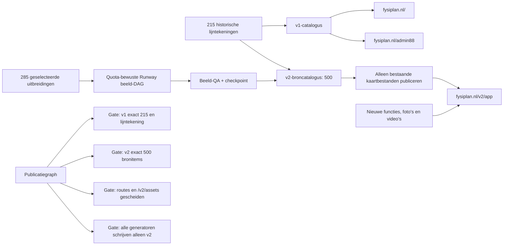

# FysiPlan publicatiekanalen

De publieke root is voortaan een stabiel productiekanaal. Nieuwe content wordt eerst en uitsluitend in v2 gepubliceerd. De scheiding wordt tijdens elke build door `scripts/publication-channel-graph.mjs` gecontroleerd.



## Contract

- `/oefeningen.json` levert de 215 historische oefeningen aan zowel `/` als `/admin88` en verwijst alleen naar het lijntekeningveld `img`.
- `/v2/oefeningen.json` levert de v2-catalogus met beheerwijzigingen, zoekmetadata, video's en alleen kaartbeelden die werkelijk op schijf staan.
- v2-kaartbeelden hebben in de browser een `/v2/images/...`-URL. De fysieke beeldmap wordt gedeeld om de 215 bestaande kaarten niet te dupliceren.
- `public/oefeningen.json` is read-only voor de productiegraphs.
- De top-500-, Runway- en achtergrondgraphs lezen en schrijven uitsluitend `public/oefeningen-v2.json`.
- Ontbrekende uitbreidingsbeelden blijven onzichtbaar tot hun eigen DAG-tak volledig is gepubliceerd; hierdoor ontstaan nooit kapotte oefenkaarten op v2.

Controleer het contract met:

```bash
npm run channels:check
```
