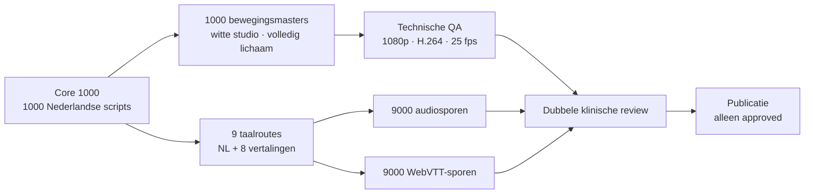
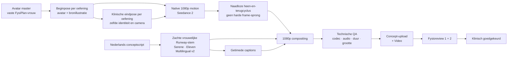

# Fysiplan video-contentfabriek

## Core 1000 — productieblauwdruk

De contentfabriek bevat naast de bestaande 215 nu een gevalideerde **FysiPlan Core 1000** in
`content/core-1000.json`: 215 bestaande items en 785 klinisch gerichte uitbreidingen. De uitbreiding
is verdeeld over zeventien domeinen, waaronder nek, schouder, hand, rug, heup, knie, enkel/voet,
balans, neurologie, vestibulair, bekkenzorg, postoperatief, pediatrie, ADL en sport. Elk item heeft
een stabiele ID, Nederlandse vierstapsuitleg, zoekmetadata, materiaal, niveau, risicoklasse,
bewegingsmaster en geblokkeerde publicatiestatus.



De video blijft beeldvullend en bevat geen titelbalk of ingebakken ondertiteling. Titel, uitleg en
WebVTT worden door de app onder of naast het beeld getoond, zodat gezicht, handen, voeten en
apparatuur nooit worden afgedekt. De avatar draagt een lichtgrijs shirt tegen een zuiver witte,
schaduwloze achtergrond.

De technische gate controleert niet alleen codec, resolutie, framerate, duur en bestandsgrootte,
maar bemonstert ook drie videoframes. De build controleert automatisch op een zichtbaar onderwerp,
heldere witte studio, afwezigheid van een donkere bovenbalk, daadwerkelijke beweging en volledige
captiondekking. Deze controles vervangen de fysioreview niet, maar halen evidente renderfouten uit
de wachtrij voordat een beoordelaar tijd verliest.

```bash
npm run core1000:check
npm run videos:languages
node scripts/video-graph.mjs plan --provider runway --manifest content/core-1000.json
```

De Runway-raming voor één eerste generatiepass is momenteel **$934,26**, vóór herkansingen. De
runner vereist altijd `--execute` én een harde `--budget-usd`-grens. Op 20 juli 2026 weigerde Runway
de eerste pilot vóór generatie omdat het API-project geen credits had; er is daardoor niets
uitgegeven. Na toevoegen van credits hervat de graph op node-hash zonder reeds geslaagde artifacts
opnieuw te betalen. De uiteindelijke representatieve proef gebruikte 442 credits ($4,42) en liet
563 credits staan; automatisch opwaarderen bleef uitgeschakeld.

De meertalige sidecar in `content/core-1000-translations.json` houdt vertaal- en taalreviewstatus
apart van de bewegingsmaster. Een gewijzigde Duitse uitleg vraagt dus geen nieuwe motionrender. Met
`node scripts/video-language-plan.mjs --export-language de` kan een volledig, stabiel
vertaalpakket voor medische taalreview worden gemaakt.

## Productiestatus van de huidige 215 oefeningen

De repository bevat nu voor alle **215/215** oefeningen een gekoppeld Nederlands conceptscript,
shotplan, materiaalset, stabiele `exerciseId` en reviewstatus in
`content/video-productie-215.json`. Tien items hebben daarnaast een expliciete extra
risicobeoordeling. Geen item staat automatisch op goedgekeurd: een script, motion-capturetake en
eindvideo doorlopen elk hun eigen poort. Zo kan een batchproces nooit een medisch onbeoordeelde
avatarvideo live zetten.

De scripts zijn bewust compact opgebouwd uit uitgangshouding, uitvoering, belangrijkste cue en een
vaste veiligheidszin. Het zijn productieconcepten, geen vervanging voor individueel fysiotherapeutisch
advies. Merkspecifieke machines worden op het fysieke apparaat geverifieerd voordat de performer ze
opneemt.

De productiebestanden worden als volgt beheerd:

```bash
# controleert exact 215 koppelingen en alle publicatiepoorten
npm run videos:production

# synchroniseert gewijzigde scripts; bestaande review- en assetvelden blijven behouden
npm run videos:production:write

# maakt de opnamelijst in studio-volgorde
npm run --silent videos:production:csv > video-opnamelijst.csv

# droge controle van dubbel goedgekeurde renders met bestandsnaam <exerciseId>.mp4
npm run videos:upload-batch -- --dir ./renders --base-url https://fysiplan.nl

# pas na controle echt koppelen aan de bestaande + Video-functie
FYSIPLAN_ADMIN_KEY='...' npm run videos:upload-batch -- \
  --dir ./renders --base-url https://fysiplan.nl --confirm-upload
```

## Productiegraph: native 1080p, herstartbaar en klinisch begrensd

De actuele conceptroute is geen handmatige lus over 215 items. `scripts/video-graph.mjs` bouwt een
gerichte acyclische graph (DAG) met één gedeelde avatarbron en een afzonderlijke, herstartbare tak
per oefening. Een fout blokkeert alleen de nakomelingen van die oefening; voltooide nodes worden op
inputhash uit de cache hervat.



De standaardroute `clinical-1080` gebruikt Runway als modelhub. Gemini 3 Pro Image maakt eerst één vaste
fotorealistische avatar. Per oefening combineert een poseframe die menselijke identiteit met de
bestaande bronillustratie. Iedere oefening krijgt een afzonderlijk controleerbaar eindframe. Seedance 2
interpoleert daar native op 1920×1080 tussen; de lokale compositor maakt van de heenbeweging een vloeiende
heen-en-terugcyclus zonder een zichtbare sprong terug naar frame één. De zachte vrouwelijke Runway-preset
`Serene` loopt als onafhankelijke tak en komt pas bij compositing samen met beeld en captions. Een
afgekeurde take kan daardoor worden vervangen zonder stem, captions of andere oefeningen opnieuw te betalen.

Als Seedance een verder geldige fysiotherapiepose expliciet door providermoderatie weigert, probeert die ene
motionnode precies één keer dezelfde native-1080p begin/eindopdracht via Veo 3.1 Fast. De fallback geldt niet
voor time-outs, programmeerfouten of kwaliteitsafkeur; zulke fouten blijven gestopt voor diagnose.

`motionKeyframes` kan de automatisch afgeleide eindpose verder klinisch specificeren. De vroegere
`economy-720`-route blijft alleen beschikbaar voor goedkope technische proeven; de QA noemt die uitvoer
nooit native 1080p. De inputhash bevat kwaliteitstier, promptversie en keyframes; gewijzigde bewegingen
maken alleen hun eigen motion en nakomelingen stale. De runner baseert uitvoerbaarheid uitsluitend op
resultaten uit de actuele run, zodat een oude geslaagde descendant nooit een mislukte nieuwe parent kan omzeilen.

```bash
# graph en actuele prijsraming tonen; geen providerkosten
npm run videos:graph
node scripts/video-graph.mjs plan --provider runway --upload-concepts \
  --motion-quality clinical-1080 --base-url https://fysiplan.nl

# goedkope 720p-route uitsluitend om graph/compositing te testen, niet als productiebeeld
node scripts/video-graph.mjs run --provider runway --execute \
  --manifest content/core-1000.json --only '<exacte titel>' \
  --motion-quality economy-720 --complex-motion-tier standard --budget-usd 0.60

# één pilot volledig maken, technisch controleren en als zichtbaar concept koppelen
RUNWAYML_API_SECRET='...' FYSIPLAN_ADMIN_KEY='...' \
  node scripts/video-graph.mjs run --provider runway --execute \
  --only fp_ff306042c93f0900 --motion-quality clinical-1080 --budget-usd 3.10 \
  --upload-concepts --approve-visual-concept --base-url https://fysiplan.nl

# na goedkeuring van de pilot de volledige graph fan-out uitvoeren
RUNWAYML_API_SECRET='...' FYSIPLAN_ADMIN_KEY='...' \
  node scripts/video-graph.mjs run --provider runway --execute \
  --motion-quality clinical-1080 --budget-usd 620 --concurrency 3 \
  --upload-concepts --approve-visual-concept --base-url https://fysiplan.nl
```

Op 22 juli 2026 raamt de native 1080p-route de eerste generatie van alle 215 items op **$618,28**, exclusief
herkansingen en belasting. Eén begrensde pilot kost maximaal circa **$3,07**. De runner weigert te starten
als de berekende nodekosten boven `--budget-usd` liggen. Runway noemt voor de gebruikte modellen 10 credits per videoseconde,
20 credits per Gemini 3 Pro-render, 40 credits per seconde Seedance 2 op 1080p en 1 credit per 50
TTS-tekens; API-credits kosten $0,01.
Zie de officiële [Runway API-prijzen](https://docs.dev.runwayml.com/guides/pricing/) en
[SDK-workflow](https://docs.dev.runwayml.com/api-details/sdks/).

## Uitkomst representatieve pilots — 20 juli 2026

Drie Nederlandse concepten zijn gegenereerd met één gedeelde avatar en de zachte vrouwelijke
`Serene`-stem. **Eenbeenstand zonder steun** en **sportspecifieke landing op één been** doorliepen
de technische en visuele gate en wachten op fysiobeoordeling. De complexe landing gebruikte na
twee kosteloze moderatieblokkades gecontroleerd Omni Flash in plaats van Seedance.

**Kin intrekken zittend** doorliep uiteindelijk ook de technische checks, maar is inhoudelijk
afgekeurd: zowel vrije generatie als start/eind-keyframes maakten onderweg te veel nekextensie.
Dit bewijst waarom `technicalQa: true` nooit gelijkstaat aan klinische goedkeuring. De nekvideo
wordt niet gepubliceerd; voor dit type subtiele driedimensionale beweging is menselijke
motion-capture of een anatomisch gerigde avatar de volgende productieroute.

De lokale provider is uitsluitend een kosteloze end-to-endtest van graph, titels, Nederlandse
systeemstem, captions, compositing, QA en upload. Hij is geen avatarproductie. Alleen de
`runway`-provider maakt de menselijk ogende pose- en motion-assets.

## Concepten zichtbaar, nooit stilzwijgend goedgekeurd

De gebruiker heeft gekozen om de conceptvideo's vóór fysiobeoordeling te laten maken. Daarom mag de
graph ze na technische QA koppelen, maar bewaart de server `reviewStatus: concept`. Op de
patiëntkaart staat dan in de gekozen taal zichtbaar **“AI-concept · beoordeling door
fysiotherapeut volgt”**. Pas na twee inhoudelijke reviews mag de status naar klinisch gecontroleerd.
Een handmatig opgenomen therapeutvideo blijft gewoon een menselijke praktijkvideo en krijgt deze
AI-markering niet.

De TTS-batch maakt eveneens alleen audio voor scripts met twee ingevulde reviewers:

```bash
ELEVENLABS_API_KEY='...' ELEVENLABS_VOICE_ID='...' \
  node scripts/video-productie.mjs --tts-dir ./audio-nl
```

## Besluit in één zin

Bouw één herkenbare digitale Fysiplan-fysiotherapeut, laat de graph alle 215 conceptbewegingen,
stemmen en video's maken, en laat fysiotherapeuten ze daarna gericht goedkeuren, corrigeren of voor
de complexe gevallen vervangen door menselijke motion capture.

Dat geeft Fysiplan een eigen, meertalige bibliotheek die klinisch controleerbaar en veel goedkoper
te onderhouden is dan per taal een volledige video opnieuw maken.

## Waarom dit anders moet dan een gewone AI-avatar

Synthesia en HeyGen zijn sterk in pratende avatars, lipsynchronisatie en templatevideo's op schaal.
Hun productdocumentatie beschrijft echter geen gegarandeerd klinisch betrouwbare full-body
biomechanica. Een tekstprompt als “doe een squat” is daarom wel een bruikbare conceptbron, maar geen
zelfstandige klinische goedkeuring. Zie de officiële
[Synthesia API- en templatedocumentatie](https://docs.synthesia.io/reference/introduction),
[Synthesia Personal Avatars](https://docs.synthesia.io/docs/personal-avatars) en
[HeyGen API-prijzen](https://help.heygen.com/en/articles/10060327-heygen-api-pricing-explained).

De beweging is het medische product. Daarom blijft iedere gegenereerde beweging zichtbaar een
concept totdat twee fysiotherapeuten de volledige take hebben gezien. Alleen afgekeurde of
onvoldoende consistente bewegingen hoeven opnieuw te worden gegenereerd of met menselijke motion
capture te worden vervangen.

## Aanbevolen stack

| Laag | Keuze | Reden |
| --- | --- | --- |
| Conceptavatar en -pose | Gemini 3 Pro Image via Runway | Krachtigste aangeboden beeldmodel, mensreferentie voor identiteit en bronillustratie als posecontext |
| Conceptmotion | Seedance 2 native 1080p via Runway | Begin/eind-keyframes voor iedere oefening; de 720p-route is alleen een technische proefstand |
| Premium/vervanging | Ervaren fysiotherapeut + vast captureprotocol | Menselijke, herhaalbare uitvoering voor afgekeurde of zeer complexe AI-takes |
| Productie motion capture | Rokoko Smartsuit Pro II | 200 fps, onbeperkt opnemen, FBX/BVH/CSV, directe Unreal/Blender-workflow en ingebouwde cleanup; [productinformatie](https://www.rokoko.com/products/smartsuit-pro) |
| Goedkope pilot | Move One op iPhone | Snel valideren zonder studio-investering; [prijzen en limieten](https://docs.move.ai/knowledge/move-one-pricing) |
| Avatar/render | Epic MetaHuman + Unreal Engine | Fotorealistische, consistente eigen avatar en controle over camera, kleding, licht en anatomische zichtbaarheid; [MetaHuman-documentatie](https://dev.epicgames.com/documentation/en-us/metahuman/metahuman-documentation) |
| Stem | Runway `Serene` op Eleven Multilingual v2 | Zachte vaste vrouwenstem, rechtstreeks in dezelfde providergraph en los van de motionmaster |
| Video delivery | Cloudflare Stream | Upload, encoding, adaptieve playback, signed URL-optie, captions en meerdere audiosporen in één videomaster; [Stream](https://developers.cloudflare.com/stream/) |
| App-koppeling | `exerciseId` + goedgekeurde catalogus | Automatische één-klik-koppeling die hernoemen en vertalen overleeft |

MetaHuman markerless body capture vanaf één camera is in Unreal 5.8 nog experimenteel en de
body-animatiefunctionaliteit is Windows-only. Gebruik dat daarom voor tests, niet als enige
productiebron. De batch-API is in 5.8 wel uitgebreid; zie de officiële
[MetaHuman 5.8 release notes](https://dev.epicgames.com/documentation/metahuman/metahuman-5-8-release-notes-in-unreal-engine).
Gezichtsanimatie kan daarna reproduceerbaar uit de goedgekeurde voice-over komen via
[Audio Driven Animation](https://dev.epicgames.com/documentation/en-us/metahuman/audio-driven-animation).
MetaHuman Animator en Creator zijn via Python te automatiseren
([Animator Python API](https://dev.epicgames.com/documentation/metahuman/python-scripting-for-metahuman-animator),
[Creator Python API](https://dev.epicgames.com/documentation/metahuman/metahuman-creator-python-scripting-in-unreal-engine)).
De 215 shots worden ten slotte als vaste queue gerenderd via Unreal
[Movie Render Queue](https://dev.epicgames.com/documentation/unreal-engine/movie-render-pipeline-in-unreal-engine)
en de officiële [commandline-rendering](https://dev.epicgames.com/documentation/en-us/unreal-engine/using-command-line-rendering-with-move-render-queue-in-unreal-engine).
Voor latere studio-opschaling is Move Genesis een professioneel markerless multi-camerasysteem met
biomechanische modellering; zie [Genesis overview](https://docs.move.ai/knowledge/genesis-overview).

Gerenderde videobestanden zijn volgens de Unreal EULA royaltyvrije “Non-Engine Products”; controleer
bij aanschaf ook de dan geldende seatvoorwaarden. Zie de [Unreal Engine EULA](https://www.unrealengine.com/en-US/eula).

## Slim opschalen naar duizenden oefeningen

Begin niet met duizend los bedachte scripts. Maak 250–400 canonieke bewegingsfamilies en bouw
klinisch relevante varianten als aparte catalogusitems:

- links/rechts of bilateraal;
- liggend, zittend en staand;
- zonder materiaal, elastiek, halter, bal of apparaat;
- regressie, basis en progressie;
- mobiliteit, isometrisch, langzaam concentrisch/excentrisch;
- verschillende veilige ROM- of tempovarianten.

Zo ontstaan 1.000–2.000 echt vindbare oefeningen zonder duizend keer de hele productie opnieuw uit
te vinden. Iedere variant blijft wel een eigen beoordeeld item; varianten zijn geen excuus om een
ongecontroleerde animatie automatisch te publiceren.

### Metadata per item

Minimaal: `exerciseId`, naam, lichaamsregio, gewricht, bewegingsrichting, houding, materiaal, zijde,
niveau, doel, uitgangshouding, uitvoering, veelgemaakte fout, doseringsvorm, contra-indicaties,
captureversie, avatarversie, talen, reviewer, reviewdatum, videoversie en status.

De huidige app leidt `exerciseId` af van het stabiele afbeeldingspad. Daardoor blijven kaarten en
video's correct gekoppeld wanneer een naam of categorie wijzigt. Nieuwe kaarten bewaren zowel ID als
leesbare naam; oudere kaarten blijven via de naamfallback werken.

## Eén visuele master, alle talen

Render per oefening één korte visuele master van ongeveer 20–32 seconden. Voeg daarna per taal een
apart audiospoor en captionbestand toe. Cloudflare Stream ondersteunt extra audiosporen en captions:

- [extra audiosporen](https://developers.cloudflare.com/stream/edit-videos/adding-additional-audio-tracks/);
- [captions](https://developers.cloudflare.com/stream/edit-videos/adding-captions/).

Daarmee hoeft een gewijzigd Turks script niet opnieuw door motion capture of Unreal. Alleen het
Turkse audio- en captionspoor verandert. De patiënt kiest de taal op de kaart; de speler toont de
beschikbare taalsporen en opent automatisch de captiontaal als die bestaat.

Gebruik één gelicentieerde Fysiplan-stem, een vaste medische woordenlijst en taalreview door een
moedertaalspreker. Een letterlijke AI-vertaling is geen publicatiegoedkeuring.
ElevenLabs ondersteunt uitspraakwoordenboeken voor vaste termen; beheer die als versieerbaar
onderdeel van de stemproductie. Zie de officiële
[pronunciation-dictionaryhandleiding](https://elevenlabs.io/docs/eleven-api/guides/how-to/text-to-speech/pronunciation-dictionaries).

## Publicatiepoort

De workflow is:

`draft → motion captured → rendered → clinical review → language review → approved → published`

Een item met `draft`, `review` of `retired` komt nooit in het patiëntmanifest. Alleen `approved` met
reviewer, reviewdatum, geldige versie en een toegestane Cloudflare Stream-URL wordt door de build
geaccepteerd. `npm run build` stopt bij een ongeldige catalogus, dus een half beoordeelde video kan
niet per ongeluk live gaan.

Voorbeeld van één gepubliceerd item:

```json
{
  "exerciseId": "fp_0123456789abcdef",
  "status": "approved",
  "provider": "cloudflare-stream",
  "iframe": "https://customer-<code>.cloudflarestream.com/<uid>/iframe",
  "languages": ["nl", "en", "tr"],
  "aiGenerated": true,
  "version": 1,
  "clinicalReview": {
    "reviewer": "BIG-geregistreerde fysiotherapeut",
    "approvedAt": "2026-08-01"
  }
}
```

De bestaande persoonlijke cliëntopname en de praktijkvideo blijven overrides. De prioriteit op de
patiëntkaart is: persoonlijke video → eigen praktijkopname → praktijk-YouTube → Fysiplan-catalogus.

## UX in Fysiplan

De therapeut doet geen tweede videohandeling:

1. Een oefening met video toont in de bibliotheek **video inbegrepen**.
2. Eén klik op `+` voegt oefening, afbeelding en videokoppeling toe.
3. Op de A4 staat een klein blauw `VIDEO`-signaal als bevestiging.
4. Op de digitale patiëntkaart verschijnt de afspeelknop automatisch.
5. De camera op de A4 blijft beschikbaar voor een persoonlijke cliëntvideo; die gaat altijd voor.

Bij AI-gerenderde catalogusvideo toont de patiëntpagina blijvend “AI-demonstratie · klinisch
gecontroleerd”. Dat helpt ook bij de transparantie-eis voor synthetische content uit artikel 50 van
de [EU AI Act](https://eur-lex.europa.eu/eli/reg/2024/1689/oj?locale=en), die vanaf 2 augustus 2026
van toepassing is.

## Kostenbeeld

Cloudflare rekent momenteel $5 per 1.000 opgeslagen videominuten en $1 per 1.000 geleverde minuten;
encoding en ingress zijn inbegrepen. Zie [Stream pricing](https://developers.cloudflare.com/stream/pricing/).
Duizend clips van gemiddeld twintig seconden zijn circa 333 opgeslagen minuten: ruim binnen de
eerste $5-opslagbundel. Honderdduizend bekeken minuten kosten ongeveer $100. Motion capture,
klinische review en taalcontrole zijn dus veel grotere kostenposten dan opslag.

Een praat-avatar-API over diezelfde 333 minuten kost op basis van HeyGen's huidige orde van grootte
ongeveer $333 bij $1/minuut of $1.332 bij $4/minuut, nog vóór taalvarianten en herproductie. Die route
lost de correcte lichaamsbeweging bovendien niet op. Mux is een bruikbaar alternatief met een
gratis deliverylaag en multi-audio; zie [Mux pricing](https://www.mux.com/pricing).

## Pilot van zes weken

1. Kies uit het manifest eerst 12 representatieve oefeningen: staand, mat, apparaat, TRX, Bosu,
   kettlebell en minstens twee `extra-review`-items. Laat twee fysiotherapeuten de definitieve
   uitvoering en foutenlijst vastleggen.
2. Bouw één Fysiplan MetaHuman, leg performer-, gezicht- en stemrechten schriftelijk vast en maak
   een vast camera/licht/kledingprotocol.
3. Capture eerst met Move One om de hele keten te bewijzen; vergelijk tien complexe bewegingen met
   Rokoko voordat de productiestack definitief wordt gekocht.
4. Publiceer Nederlands, Engels en Turks, ieder met captions en taalreview.
5. Laat twee fysiotherapeuten onafhankelijk op uitvoering, camerazicht, tempo en veiligheidszin
   controleren; verschillen moeten vóór publicatie worden opgelost.
6. Laat pas na een foutloze ketentest de overige 203 items per materiaalbatch opnemen. Bij gemiddeld
   vijf tot acht minuten capturetijd per oefening is alleen de motion-capturedag circa 18–29 uur;
   plan daarnaast cleanup, render, uitspraakcontrole en dubbele klinische review.
7. Meet afspelen, volledig bekijken, patiëntbegrip en therapietrouw — geen diagnose of automatische
   voorschrijfbeslissing.

Video bij een thuisoefenprogramma kan gedrag verbeteren: in een RCT na beroerte was de
3-maandentrouw 75,6% met video tegenover 55,2% met hand-outs
([PubMed](https://pubmed.ncbi.nlm.nih.gov/32489241/)). Een systematische review vond in zeven van tien
RCT's voordeel voor digitale interventies, maar noemt langetermijneffecten nog onzeker
([PubMed](https://pubmed.ncbi.nlm.nih.gov/36184611/)). Daarom eerst het 50-video-cohort meten en pas
daarna de productielijn naar 250 en 1.000 items opschalen.

## Dagelijks beheer

- Exporteer de capturewachtrij met `npm run --silent videos:production:csv > video-opnamelijst.csv`.
- Genereer stem en render pas nadat twee namen en een reviewdatum bij het script zijn vastgelegd.
- Laat het batch-uploadscript standaard in droge modus draaien; `--confirm-upload` is een bewuste tweede stap.
- Voeg alleen na beide reviews een item aan `content/video-catalogus.json` toe.
- Controleer met `npm run videos:check`.
- Publiceer een wijziging als nieuwe `version`; overschrijf nooit stil een klinisch goedgekeurde
  versie. Bewaar bronmotion, renderinstellingen, scripts, audio en reviewformulier buiten de app in
  een versiegestuurde productieopslag.
